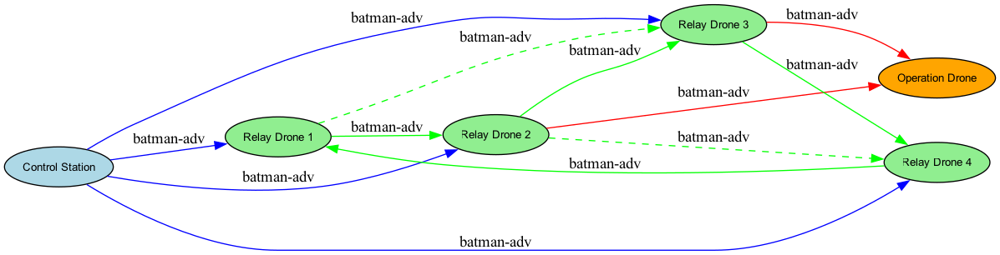

# Drone Mesh Network with batman-adv

This is a Raspi image for building a drone mesh network using BATMAN-adv.

This project demonstrates a robust drone mesh network using the batman-adv protocol. The network is designed to interconnect multiple drones—including dedicated relay drones as well as attack drones that double as relay nodes—to ensure continuous and resilient communication. By having attack drones serve as relay nodes, command propagation is accelerated, thereby reducing the attack interval and improving mission responsiveness.

## Network Diagram

Below is a diagram illustrating the mesh network configuration:



**Diagram Legend:**
- **Control Station:** The ground control center that manages mission planning and drone operations.
- **Relay Drones:** Drones that act as communication relays within the mesh. These include both dedicated relay drones and attack drones that also serve as relay nodes.
- **Operation Drone:** The target drone that performs specific tasks based on commands routed through the mesh network.

## Project Overview

The mesh network is built using the batman-adv protocol, which provides dynamic, self-healing routing between nodes. Key benefits of this network design include:

- **Resilient Communication:** Maintains connectivity even when some nodes fail or drop out.
- **Scalability:** Easily extendable by adding more relay or attack drones.
- **Reduced Attack Interval:** Utilizing attack drones as relay nodes accelerates command dissemination, thereby reducing the time between successive attacks and improving overall operational tempo.

## How It Works

- **Control Station:** Connects to multiple relay nodes via the batman-adv protocol.
- **Relay Drones:** Form a mesh network by connecting with each other, ensuring that data can route through multiple redundant paths.
- **Attack Drones as Relays:** In addition to carrying out offensive missions, attack drones participate in the mesh network as relay nodes. This dual functionality ensures faster command propagation and a reduced attack interval.
- **Operation Drone:** Receives commands from several relay nodes, ensuring that critical instructions reach the target quickly and reliably.


```
curl -O https://github.com/kyohah/raspberry-pi-imgage-BATMAN-adv/releases/#
```

# find the identifier of the device you want to flash
diskutil list

# un-mount the disk
diskutil unmountDisk /dev/disk2

# flash the image, go for a coffee
sudo dd bs=4m if=output-arm-image/image of=/dev/disk2

# eject the disk
diskutil eject /dev/disk2
